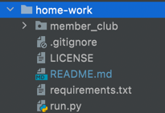
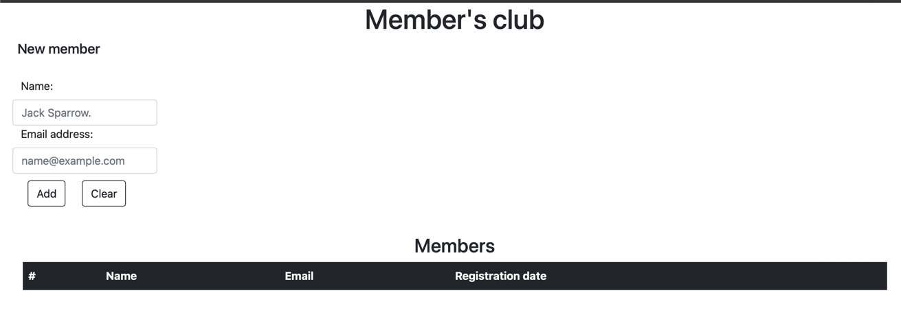

# home-work
If you haven't installed python3.x, please follow the link
https://www.python.org/downloads/
and install python for you system

1. When python3 is installed, choose or create a directory
   for the project, after that you need to download the source code
    - from https://github.com/ivanpugachtd/home-work and open the project
    - or you can download by running "git clone https://github.com/ivanpugachtd/home-work.git"
      if you are using *nix like system
2. Run terminal commands one by one:
   (make sure your terminal opened in the project's "home-work" directory) 

   - python3 -m venv venv
   - source venv/bin/activate
   - pip3 install -r requirements.txt
   
3. Now you can run the project by:
   (make sure that you have activated venv from previous step
    'source venv/bin/activate' from your terminal)
   
   - python run.py
   - project running on the url = http://127.0.0.1:5000/
   - follow the link and you should be able to see 
   